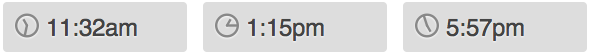

PE-Analog-Clock-icon-font
=========================

A set of icons for displaying a visual ("analog") representation of time stamps. 

The Analog Clock icon set allows <code>&lt;time&gt;</code> elements to have a visual notation in a simple, progressive way using a @font-face to deliver a custom font for the clock face. The icon is therefore scalable and can be styled with CSS to match most site designs. 

The required HTML can be implemented server-side in any application to output the desired icons. Optionally, for users that do not have server-side access, a javascript plug-in can sniff out <code>&lt;time&gt;</code> elements and add the HTML necessary for the icon set. Both options are documented in the sample and can be modified to fit specific situations. 

The CSS uses <code>:before</code> pseudo elements to place the icons, therefore, there is no extraneous HTML content present when the <code>:before</code> element is not supported. Graceful fallback to the contents of the <code>&lt;time&gt;</code> element.

<strong>Supports:</strong>

<ul>
<li>Military time</li>
<li>Overlapping digit notations: <code>hour-00</code>, <code>hour-24</code>, <code>minute-00</code>, <code>minute-60</code>
<li>Single digit hour values: <code>hour-01</code> as well as <code>hour-1</code></li>
</ul>

<h2>Sample</h2>
Since GitHub readme does not support @font-face, here is a sample image of what the icon font looks like with very little CSS applied to it:

<h2>How it Works</h2>

The font file contains glyphs for hours and minutes. The glyphs for the hours contains the circle outline as well. To cut down on the number of glyphs needed for minutes, the font contains a glyph for every third minute (3, 6, 9, 12, 15, etc...) which hits the quarter hours perfectly. We also decided that at most sizes, a difference of three minutes is all most people will recognize. For browsers that support CSS3 for <code>transform: rotate()</code> every position for the minute hand is represented. 

The <code>&lt;span&gt;</code> for the minute hand is nested inside of the hour. The hour has <code>position: relative</code> while the minute has <code>position: absolute</code>. In this way, they can overlap each other to create a clock face and represent many different combinations of hour and minute. 

<h2>Browser Support</h2>
Browsers need to support <code>@font-face</code> as well as <code>:before</code> pseudo-elements. This font and CSS has been tested in:

<h3>Windows browsers</h3>
<ul>
<li>IE 8 and above</li>
<li>Firefox 3.6 and above</li>
<li>Safari 4.0 and above</li>
<li>Chrome 14.0 and above</li>
<li>Opera 11.1 and above</li>
</ul>

<h3>Mac browsers (Snow Leopard)</h3>
<ul>
<li>Firefox 3.6 and above</li>
<li>Safari 4.0 and above</li>
<li>Chrome 14.0 and above</li>
<li>Opera 11.1 and above</li>
</ul>

<h3>iOS</h3>
<ul>
<li>iPhone 4S (iOS 5.1) and above</li>
</ul>

<h3>Android</h3>
<ul>
<li>Android 4.0.3 and above on most devices</li>
</ul>

<h2>Show us what you&rsquo;ve got!</h2>
<a href="j@projectevolution.com">Send us links to the icon font in use</a>, and happy coding.

Open source coolness from <a href="http://www.projectevolution.com" title="Python and Django developers in Providence, RI">Project Evolution</a> &copy;2012